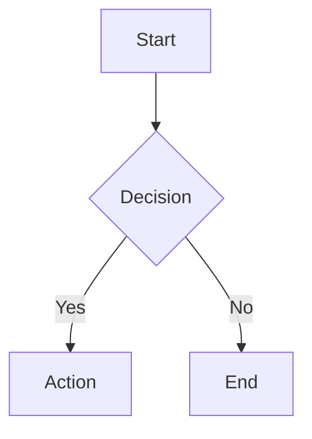

# /mermaidjs-v11 — Mermaid.js v11 Diagrams

Create text-based diagrams with Mermaid v11 declarative syntax.

## Usage

When to use: architecture diagrams, API flows, DB schemas, state machines, timelines, user journeys.

## Diagram Types

- `flowchart` — process flows, decision trees
- `sequenceDiagram` — actor interactions, API flows
- `classDiagram` — OOP structures, data models
- `stateDiagram` — state machines, workflows
- `erDiagram` — database relationships
- `gantt` — project timelines
- `journey` — user experience flows

See `references/diagram-types.md` for all 24+ types.

## Syntax

````markdown

````

With config frontmatter:
````markdown

````

## CLI

```bash
npm install -g @mermaid-js/mermaid-cli
mmdc -i diagram.mmd -o diagram.svg
mmdc -i input.mmd -o output.png -t dark -b transparent
```

## Rules

- Comments: `%% ` prefix
- Themes: `default`, `dark`, `forest`, `neutral`, `base`
- Security: `strict` | `loose` | `antiscript`
- Load `references/` only when needed for advanced patterns
